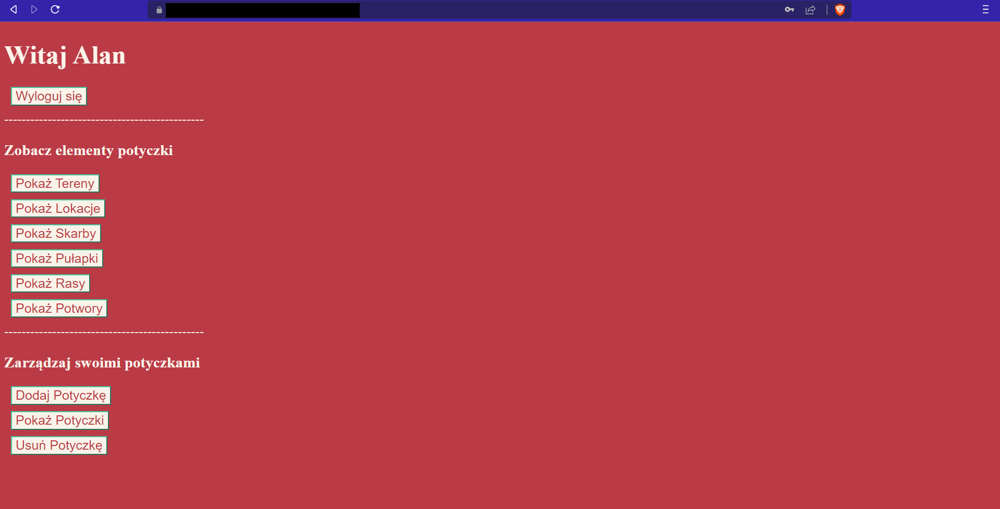

# RPG-encounter-database
### A simple database application to save encounters for RPG games

## Overview

It allows to store encounters, show them and delete them. ADMIN has rights to modify more than a user.



## Instalation

* First install requirements
```
pip install -r requirements.txt
```
* Then run migrations (Only once)
```
python manage.py migrate
```
* Finally run app
```
python manage.py runserver
```
